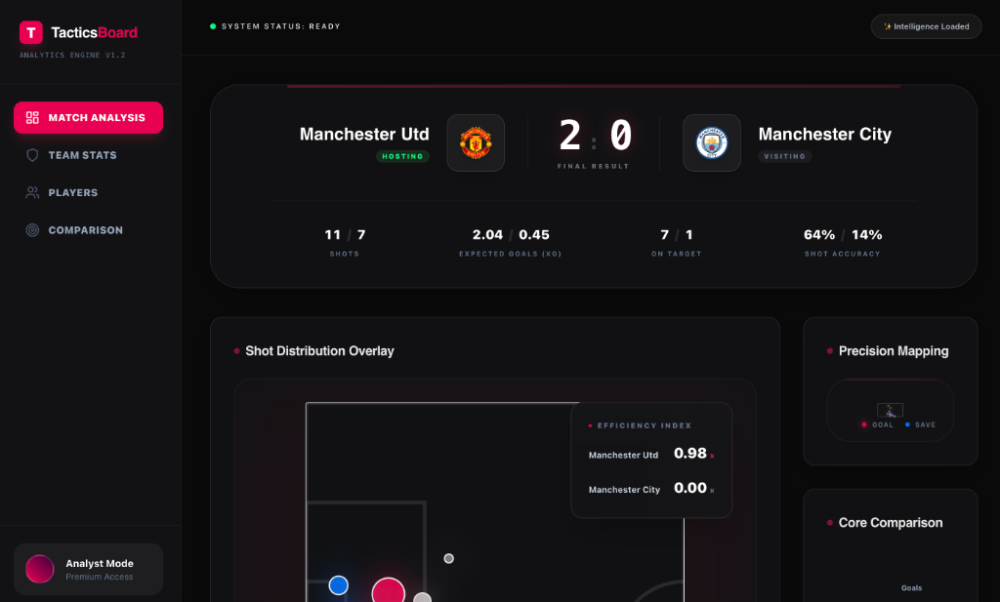
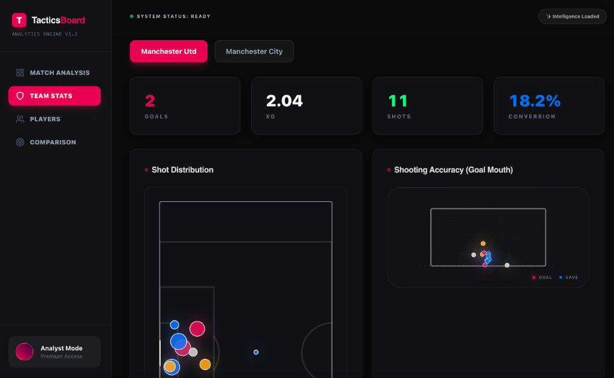
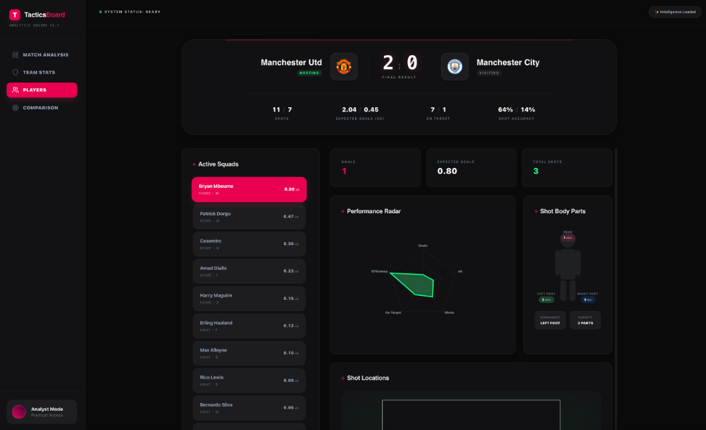
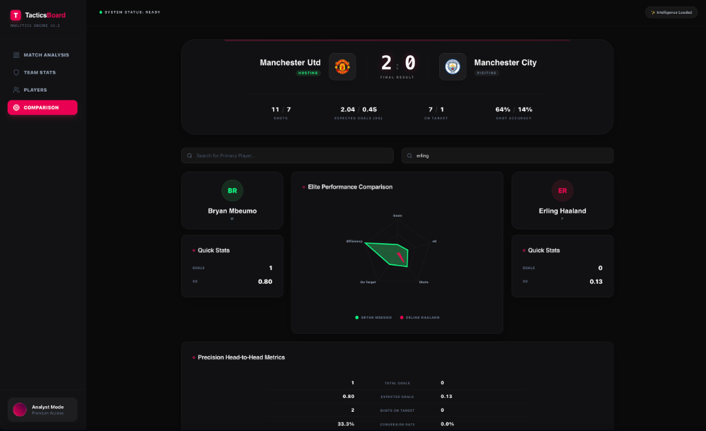

# TacticsBoard: Premium Football Analytics Engine ⚽📊

TacticsBoard is a high-fidelity football analytics dashboard built with Next.js, featuring advanced tactical insights and stunning visualizations. It processes match data (JSON/CSV) to generate professional-grade reports on team performance and player efficiency.



## 🚀 Key Features

### 🏟️ Match Intelligence
- **High-Fidelity Scoreboard**: Real-time final result display with automated club logo matching.
- **Efficiency Index**: Advanced metric comparing goals scored vs expected goals (xG).
- **Tactical Overlays**: Dynamic shot maps with xG-sized indicators and outcome status.

### 🛡️ Team Performance
- **Goal Mouth Accuracy**: 2D visualization of shot placement relative to the goal frame.
- **Stat Grid**: Comprehensive breakdown of shots, xG, on-target percentage, and conversion rates.
- **Match Flow**: xG timeline showing the cumulative threat throughout the 90 minutes.



### 👤 Elite Player Analytics
- **Performance Radar**: Normalized multi-variable charts for goals, xG, shots, and efficiency.
- **Shot Body Parts**: Unique silhouette visualization showing shot distribution by head, left foot, and right foot.
- **Heat Maps**: Predictive shot location analysis for individual squad members.



### 🔍 Head-to-Head Comparison
- **Dual Radar Plots**: Overlapping polygons for direct side-by-side performance benchmarking.
- **Precision Metrics**: Detailed statistical comparison between two selected players.
- **Global Search**: Snappy search interface to quickly find and compare any player in the squad.



## 🛠️ Technical Stack

- **Framework**: Next.js 14 (App Router)
- **Styling**: Vanilla CSS with Tailwind-inspired utilities and Glassmorphism.
- **Charts**: Recharts (Customized for premium dark mode).
- **State Management**: Zustand.
- **Icons**: Lucide React.
- **Data Parsing**: Custom Engine for Opta/StatsBomb normalization.

## 📦 Installation & Setup

1. **Clone the repository**:
   ```bash
   git clone [your-repo-url]
   cd match_dashboard/temp_src
   ```

2. **Install dependencies**:
   ```bash
   npm install
   ```

3. **Run the development server**:
   ```bash
   npm run dev
   ```

4. **Open the app**:
   Navigate to `http://localhost:3000`.

## 📂 Data Structure

The engine expects match intelligence in JSON format with the following core schema:
- `events`: Array of shot/match events with coordinates and xG values.
- `lineups` (Optional): Team roster information.

---
Built by Antigravity AI @ Google DeepMind
